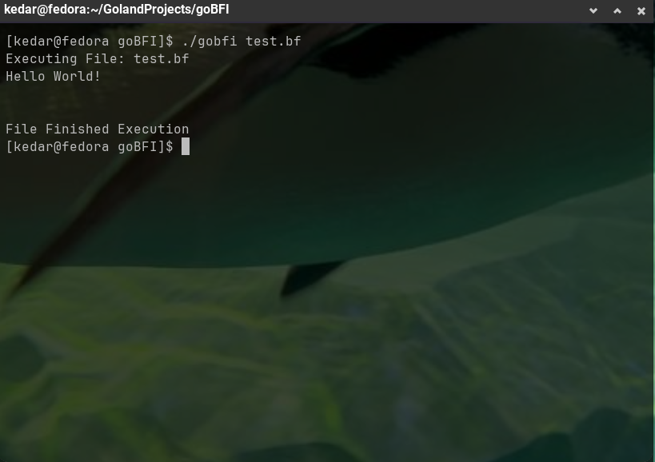

<br/>
<p align="center">
  <h3 align="center">goBFI</h3>

  <p align="center">
    A simple interpreter for GoLang
    <br/>
    <br/>
    <a href="https://github.com/ked1108/gobfi/issues">Report Bug</a>
    .
    <a href="https://github.com/ked1108/gobfi/issues">Request Feature</a>
  </p>
</p>

   

## Table Of Contents

* [About the Project](#about-the-project)
* [Built With](#built-with)
* [Getting Started](#getting-started)
  * [Installation](#installation)
* [Usage](#usage)
* [Contributing](#contributing)
* [License](#license)
* [Authors](#authors)
* [Acknowledgements](#acknowledgements)

## About The Project



This is a simple project I made while I was on my flight from Chennai to Mumbai with 2 hours to kill

## Built With

The project is extremely simple and uses nothing out sideof the go standard library

## Getting Started

To use this project you need golang installed on your system
You can get it from here: https://go.dev/doc/install

### Installation

1. Install GoLang

2. Clone the repo

```sh
git clone https://github.com/ked1108/goBFI.git && cd goBFI
```

3. build the program

```sh
go build -o gobfi
```

4. Executable is stored in the newly created bin folder, you can if you want to add it to your path or wherever your scripts are located

## Usage

You can test your brainfuck code by running 
```sh
./gobfi your_file.bf
```
A sample Hello World is provided in the repo under test.bf

## Contributing

Contributions are what make the open source community such an amazing place to be learn, inspire, and create. Any contributions you make are **greatly appreciated**.
* If you have suggestions for adding or removing projects, feel free to [open an issue](https://github.com/ked1108/gobfi/issues/new) to discuss it, or directly create a pull request after you edit the *README.md* file with necessary changes.
* Please make sure you check your spelling and grammar.
* Create individual PR for each suggestion.

### Creating A Pull Request

1. Fork the Project
2. Create your Feature Branch (`git checkout -b feature/AmazingFeature`)
3. Commit your Changes (`git commit -m 'Add some AmazingFeature'`)
4. Push to the Branch (`git push origin feature/AmazingFeature`)
5. Open a Pull Request

## License

Distributed under the MIT License. See [LICENSE](https://github.com/ked1108/gobfi/blob/main/LICENSE.md) for more information.

## Authors

* **Kedar Shinde** - *Comp Sci Student* - [Kedar Shinde](https://github.com/ked1108/) - *Built the Brainfuck interpreter*

